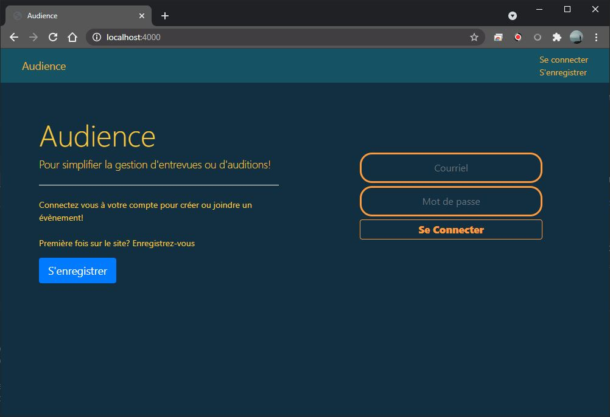
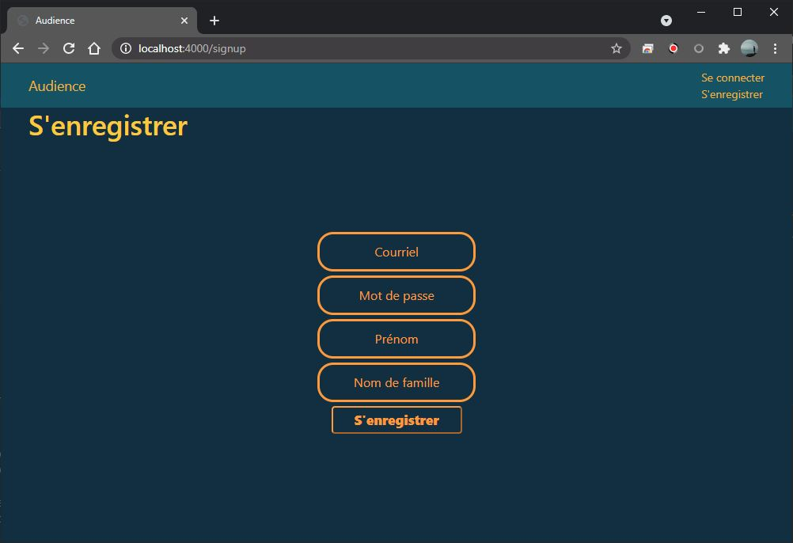
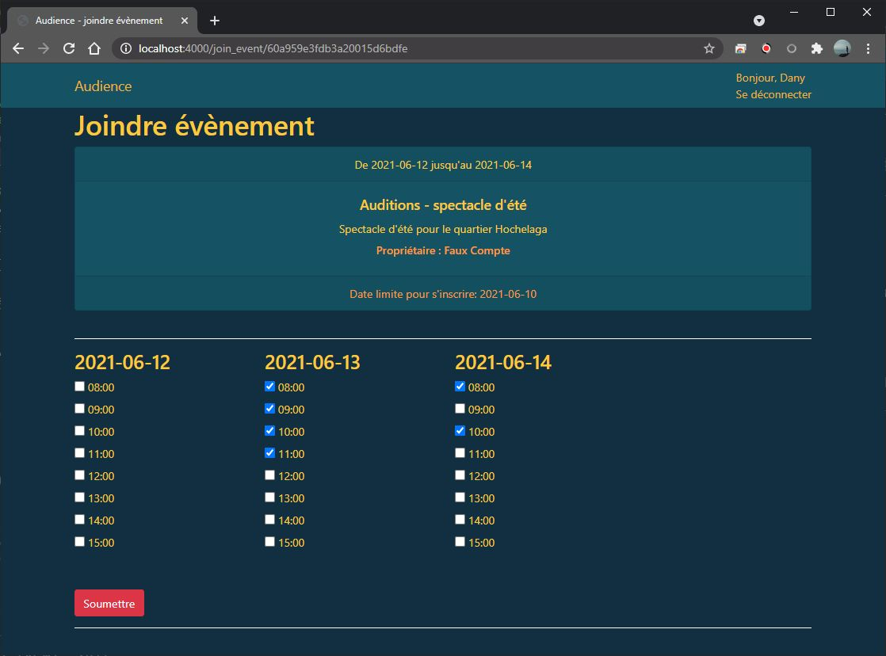
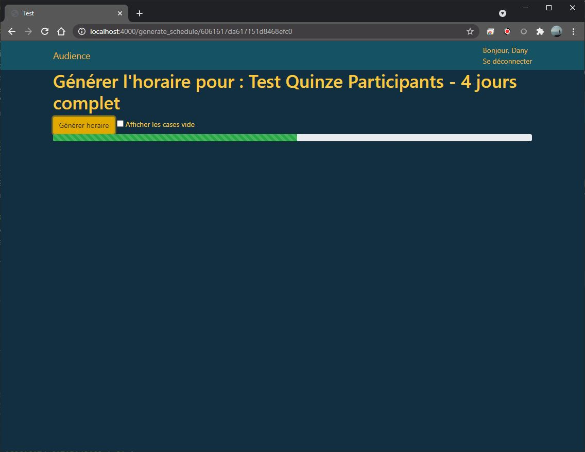
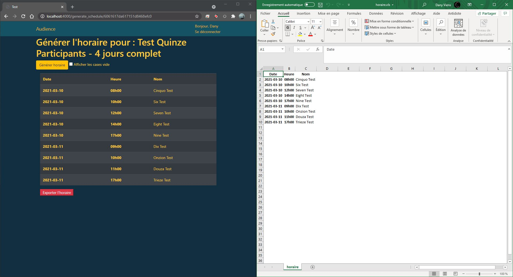

# Audience - C61-ProjetSynthese
&nbsp;
Le 24 mai 2021 

## Sommaire
Mon projet a pour titre « Audience », il s’agit d’une application web simplifiant la gestion d’entrevues ou d’auditions en cinq étapes rapides : 

1. Vous vous créez un compte utilisateur
2. Vous créez un évènement 
3. Vous partagez le lien de cet évènement 
4. Les participants ajoutent leurs disponibilités (après s'être créé un compte)
5. Un algorithme générera l’horaire optimal.  

L'horaire généré placera chaque participant dans une case horaire unique selon les disponibilités fournies. 

&nbsp;
&nbsp; 

## Installation

1. Installer Node.Js :
    - [Site web officiel](https://nodejs.org/en/)
    - La version utilisée pour ce travail a été la version 14.15.4

2. Installer les modules requis pour le projet :
    - À partir d'un terminal ou de l'invite de commandes dans le dossier 'dev' :
        > * "npm i"      
        ou   
        > * "npm install"

3. Pour lancer le serveur : 
    - À partir d'un terminal ou de l'invite de commandes dans le dossier 'dev' : 
        >  "npm start"     

4. Pour accéder au serveur : 
    > http://localhost:4000/
  
&nbsp;
&nbsp;  

    Une version de l'application est disponible sur Heroku.  
    À l'adresse suivante : https://get-audience.herokuapp.com/index

&nbsp;
&nbsp; 

# Utilisation

### 1. Une fois le serveur lancé, cliquez sur le bouton bleu "S'enregistrer" pour créer un compte.

### 2. Entrez vos informations.

### 3. Vous serez amené sur la page d'accueil. Vous aurez alors la possibilité de créer ou de joindre un évènement.

### 5. Joindre un évènement : coller l'identifiant de l'évènement dans la case correspondante. Il sera alors possible d'ajouter et sauvegarder ces disponibilités. 

 
### 5. Créer un évènement : depuis l'écran d'accueil cliquez sur "créer un évènement". Dans la nouvelle page, fournir les renseignements demandés:
- Titre, Description
- Date de  fin et de début
- Heure de fin et de début des plages horaires d'une heure
- Date limite qu'auront les participants pour se joindre à l'évènement

### 6. Générer un horaire : depuis l'écran d'accueil cliquez sur le bouton "générer" de l'évènement voulu. Et une fois de plus sur le bouton "Générer horaire"
- Note : Il est seulement possible de générer un horaire après la date limite. 
- Si l'horaire n'a pu associer une case horaire pour tous les participants, un message d'erreur s'affichera avec le nom des participants problématiques. 

### 6. Exporter l'horaire, une fois l'horaire généré cliquez sur l'option "exporter l'horaire" pour télécharger l'horaire en format compatible avec Excel.

&nbsp;
&nbsp; 

## Références
Deux outils de références m'ont été utiles pour apprendre Node.js en début de session.

1. [Le tutoriel en ligne de Node.js et Express disponible sur MDN Web Docs](https://developer.mozilla.org/en-US/docs/Learn/Server-side/Express_Nodejs)

2. Médiagraphie d'introduction à Express et Node.Js  

    >   M. HAHN Evan (2016) "Express in Action : Writing, building, and testing Node.js applications", Manning Publications, 258p.

&nbsp;
&nbsp; 

## Contact 

Dany Viens   
- Courriel : dany.viens@gmail.com

- GitHub : [DanyVns](https://github.com/DanyVns)
